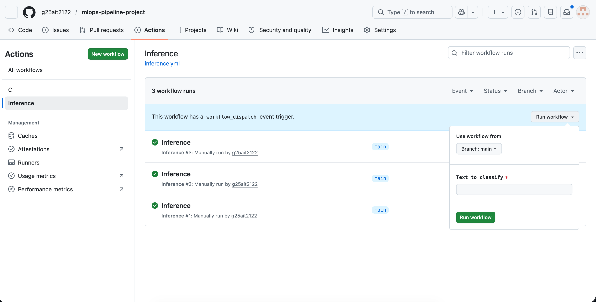
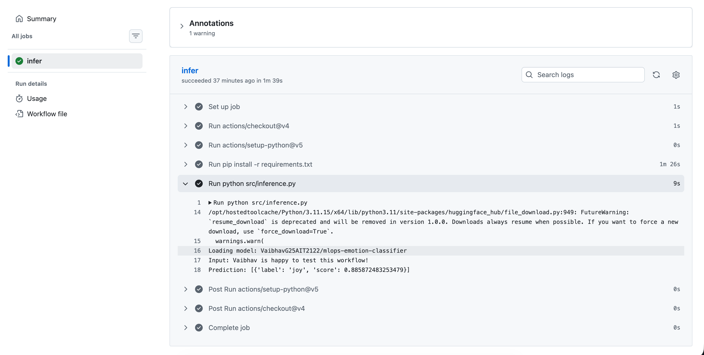

# MLOps Emotion Classifier Pipeline

An end-to-end MLOps pipeline that fine-tunes DistilBERT for emotion classification with W&B experiment tracking. Built for the PGD AI Program at IIT Jodhpur, this project demonstrates model training, deployment workflows, and CI/CD practices with GitHub Actions and Docker.

## What Does This Thing Do?

Simple - it takes text and tells you what emotion it expresses. Think "I love machine learning!" → joy, or "This bug won't fix itself" → anger. We fine-tuned DistilBERT to classify text into 6 categories:

- sadness
- joy  
- love
- anger
- fear
- surprise

## Project Structure

```
mlops-pipeline-project/
├── .github/workflows/
│   ├── ci.yml              # Linting on every push to develop
│   └── inference.yml       # Manual inference workflow
├── src/
│   ├── data_prep.py        # Dataset loading and preprocessing
│   └── inference.py        # Model inference script
├── Dockerfile              # Container setup for deployment
├── requirements.txt        # Python dependencies
├── id2label.json           # Label mapping (0→sadness, etc.)
└── README.md               # You're reading it
```

## Pipeline Architecture

### CI/CD Pipeline (GitHub Actions)
```
┌──────────────────────────────────────────────────────────────┐
│                    Developer Push to develop                 │
└──────────────────────────────────────────────────────────────┘
                              │
                              ▼
                    ┌─────────────────┐
                    │   GitHub Action │
                    │   (CI Workflow) │
                    └────────┬────────┘
                             │
                             ▼
                    ┌─────────────────┐
                    │  Checkout Code  │
                    └────────┬────────┘
                             │
                             ▼
                    ┌─────────────────┐
                    │  Setup Python   │
                    │     3.11        │
                    └────────┬────────┘
                             │
                             ▼
                    ┌─────────────────┐
                    │  Install Deps   │
                    └────────┬────────┘
                             │
                             ▼
                    ┌─────────────────┐
                    │  Run Flake8     │
                    │  Lint Check     │
                    └────────┬────────┘
                             │
                    ┌────────┴────────┐
                    │                 │
                  PASS              FAIL
                    │                 │
                    ▼                 ▼
               ✅ Merge           ❌ Fix Code
```

### Inference Pipeline (Manual Trigger)
```
┌──────────────────────────────────────────────────────────────┐
│            User Triggers Workflow from GitHub UI             │
│                   (Provides input text)                      │
└──────────────────────────────────────────────────────────────┘
                              │
                              ▼
                    ┌─────────────────┐
                    │  GitHub Action  │
                    │   (Inference)   │
                    └────────┬────────┘
                             │
                             ▼
                    ┌─────────────────┐
                    │  Checkout Code  │
                    └────────┬────────┘
                             │
                             ▼
                    ┌─────────────────┐
                    │                 │
                    │  Install Deps   │
                    │                 │
                    └────────┬────────┘
                             │
                             ▼
                    ┌─────────────────┐
                    │   Load Model    │
                    │   From HF Hub   │
                    └────────┬────────┘
                             │
                             ▼
                    ┌─────────────────┐
                    │                 │
                    │  Run Inference  │
                    │                 │
                    └────────┬────────┘
                             │
                             ▼
                    ┌─────────────────┐
                    │  Output Result  │
                    │  emotion: joy   │
                    └─────────────────┘
```

## Quick Start

### Prerequisites
- Python 3.11
- HuggingFace account + token (for model access)
- Docker (optional, for containerized deployment)

### Installation

Clone the repo:
```bash
git clone https://github.com/g25ait2122/mlops-pipeline-project.git
cd mlops-pipeline-project
```

Install dependencies:
```bash
pip install -r requirements.txt
```

### Running Inference Locally

Set your environment variables:
```bash
export HF_TOKEN="your_huggingface_token"
export HF_MODEL_NAME="VaibhavG25AIT2122/mlops-emotion-classifier"
export INPUT_TEXT="I'm so excited about this project!"
```

Run inference:
```bash
python src/inference.py
```

Expected output:
```
Loading model: VaibhavG25AIT2122/mlops-emotion-classifier
Input: I'm so excited about this project!
Prediction: [{'label': 'joy', 'score': 0.8234}]
```

### Using the Model Directly

```python
from transformers import pipeline

classifier = pipeline("text-classification", model="VaibhavG25AIT2122/mlops-emotion-classifier")
result = classifier("Rush hour traffic is driving me crazy!")
print(result)  # [{'label': 'anger', 'score': 0.XX}]
```

### Docker Deployment

Build the image:
```bash
docker build -t emotion-classifier \
  --build-arg HF_MODEL_NAME="VaibhavG25AIT2122/mlops-emotion-classifier" .
```

Run the container:
```bash
docker run -e HF_TOKEN="your_token" \
           -e INPUT_TEXT="Docker makes deployment easy!" \
           emotion-classifier
```

### Pre-built Docker Image (Docker Hub)

A ready-to-use Docker image is available on Docker Hub for quick deployment:

**Image:** `g25ait2122/mlops-a3-inference:latest`  
**Docker Hub:** [https://hub.docker.com/r/g25ait2122/mlops-a3-inference](https://hub.docker.com/r/g25ait2122/mlops-a3-inference)

Pull the image:
```bash
docker pull g25ait2122/mlops-a3-inference:latest
```

Run inference with the pre-built image:
```bash
docker run -e HF_TOKEN="your_token" \
           -e INPUT_TEXT="This is amazing!" \
           g25ait2122/mlops-a3-inference:latest
```

This image comes pre-configured with:
- Python 3.11 runtime
- All required dependencies
- Model: `VaibhavG25AIT2122/mlops-emotion-classifier`
- Optimized for production deployment

## GitHub Actions Workflows

### CI Workflow
**Trigger:** Push to `develop` or PR to `main`  
**What it does:** Runs flake8 linting on all Python files in `src/`

### Inference Workflow
**Trigger:** Manual (workflow_dispatch)  
**What it does:** Takes user input text and runs inference on the deployed model

To trigger manually:
1. Go to **Actions** tab
2. Select **Inference** workflow
3. Click **Run workflow**
4. Enter your text and click **Run**

### Inference Workflow in Action

The workflow now appears in GitHub Actions and can be triggered manually:



Example inference run showing successful emotion classification:



The workflow successfully:
- Loads the model from HuggingFace Hub
- Processes the input text
- Returns emotion predictions with confidence scores

## Model Details

### Training Configuration
- **Base Model:** distilbert-base-uncased
- **Dataset:** dair-ai/emotion (2000 samples)
- **Epochs:** 2 per experiment
- **Learning Rates Tested:** 3e-5, 5e-5 (multiple experiments)
- **Batch Size:** 16 per device
- **Experiment Tracking:** Weights & Biases ([View experiments](https://wandb.ai/g25ait2122-iit-jodhpur/mlops-assignment3))
- **Best Model Performance:** ~82% accuracy, ~0.81 F1 score

### Training Process

1. **Data Preparation** (`data_prep.py`):
   - Load samples from emotion dataset
   - Drop null values
   - Lowercase text preprocessing
   - Create label mappings (saved to `id2label.json`)

2. **Model Fine-tuning** ([Kaggle Notebook](https://www.kaggle.com/code/vaibhavg25ait2122/mlops-pipeline-project)):
   - Fine-tuned DistilBERT using HuggingFace Transformers
   - Ran multiple experiments with different learning rates (3e-5, 5e-5)
   - Tracked all experiments with W&B for loss curves and metrics comparison
   - Trained for 2 epochs per experiment
   - Pushed best performing model to HuggingFace Hub

3. **Deployment**:
   - Model hosted on [HuggingFace Hub](https://huggingface.co/VaibhavG25AIT2122/mlops-emotion-classifier)
   - Accessible via: `VaibhavG25AIT2122/mlops-emotion-classifier`

## Known Issues & Fixes

### DistilBERT token_type_ids Error
DistilBERT doesn't use token_type_ids. Fixed by configuring tokenizer:
```python
tokenizer.model_input_names = ["input_ids", "attention_mask"]
```

### NumPy 2.x Compatibility
PyTorch/transformers libraries aren't compatible with NumPy 2.x yet. Pinned to `numpy<2` in requirements.

## Development

### Branch Strategy
- `main` - Production-ready code
- `develop` - Active development

CI runs on pushes to `develop`. PRs required to merge into `main`.

### Code Quality
We use flake8 with max line length 120. Run locally:
```bash
flake8 src/ --max-line-length=120
```

## Why This Project Exists

This was built for an MLOps assignment to demonstrate:
- Model fine-tuning with multiple experiments
- Experiment tracking and comparison using Weights & Biases
- Model deployment and inference workflows
- Version control with Git
- CI/CD with GitHub Actions
- Containerization with Docker
- Model hosting on HuggingFace Hub
- Automated testing and linting

Complete MLOps pipeline from training to deployment, showing how to fine-tune a model with systematic experimentation, track metrics across runs, and build production ready infrastructure around it.

## License

MIT License

## Team

**Group 15**  
PGD AI Program, IIT Jodhpur

```
Vaibhav Dwivedi
Hemant Kumar
Mughendar R
Kaustubh Karvekar
```

## Project Links

- **GitHub Repository:** [https://github.com/g25ait2122/mlops-pipeline-project](https://github.com/g25ait2122/mlops-pipeline-project)
- **Kaggle Notebook:** [https://www.kaggle.com/code/vaibhavg25ait2122/mlops-pipeline-project](https://www.kaggle.com/code/vaibhavg25ait2122/mlops-pipeline-project)
- **Kaggle Notebook Improvement:** [https://www.kaggle.com/code/hemantkumarsri/mlops-pipeline-project-hemant-experiment](https://www.kaggle.com/code/hemantkumarsri/mlops-pipeline-project-hemant-experiment)
- **HuggingFace Model:** [https://huggingface.co/VaibhavG25AIT2122/mlops-emotion-classifier](https://huggingface.co/VaibhavG25AIT2122/mlops-emotion-classifier)
- **W&B Experiments:** [https://wandb.ai/g25ait2122-iit-jodhpur/mlops-assignment3](https://wandb.ai/g25ait2122-iit-jodhpur/mlops-assignment3?nw=nwuserg25ait2122)
- **Docker Hub:** [https://hub.docker.com/r/g25ait2122/mlops-a3-inference](https://hub.docker.com/r/g25ait2122/mlops-a3-inference)

---

**Issues?** Feel free to create an issue on GitHub
